# Prerequisites
* Ubuntu 20.04


# Installing Arduino IDE

To install IDE:
```
$ wget https://github.com/arduino/arduino-ide/releases/download/2.0.0/arduino-ide_2.0.0_Linux_64bit.zip
$ unzip ./arduino-ide_2.0.0_Linux_64bit.zip
```
Unzipped folder shall arduino-ide executable.


Add your user to *dialout* for accessing /dev/ttyACM0
```
$ sudo usermod -a -G dialout $USER
```

Check /dev/ttyACM0, it shall belong to ***dialout*** gropup.
```
$ ls -al /dev/ttyACM0
crw-rw---- 1 root dialout 166, 0 ноя  7 21:16 /dev/ttyACM0
```

Reboot your device and open Arduino IDE.


# Parts

<div align="center">
    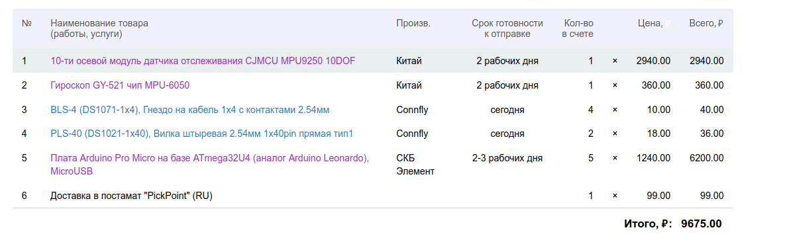
</div>


## CHARGER block
* Модуль заряда для Li-Ion батареи на чипе TP4056, или аналогичном, с контролем перезаряда батареи.
* Трёхконтактный разъем "папа" PLS3 с максимальным током 1А или больше, для подключения к основному модулю.


## NECK block
* GY-521
  * GY-521/MPU 6050 (3-х осевой гироскоп и акселерометр)
  * (Гироскоп GY-521 чип MPU-6050)[https://www.chipdip.ru/product0/8009337879]
* Четырёхконтактный разъем "папа" PLS-4 надля подключения блока NECK к основному блоку HEAD.


## HEAD block


### [HEAD]Arduino Pro Micro (ATmega32U4)

<div align="center">
    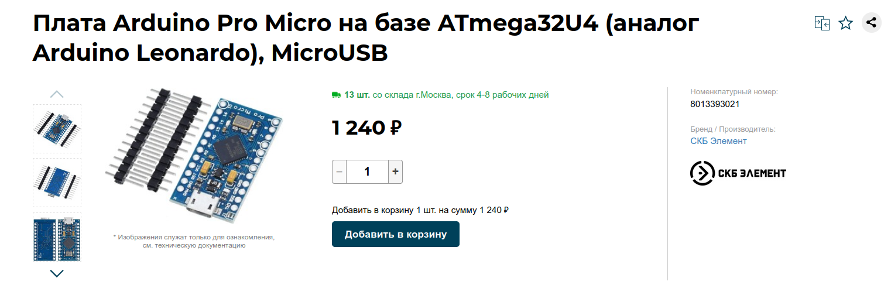
</div>

<div align="center">
    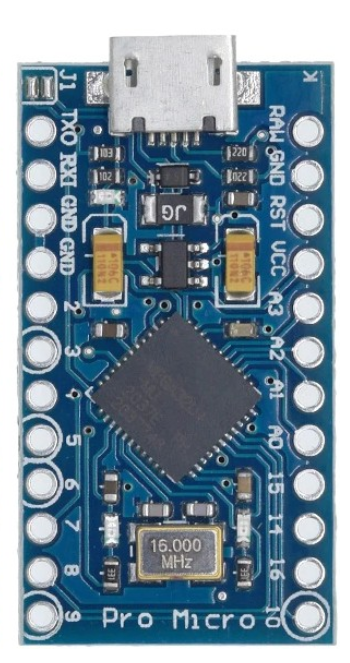
</div>

<div align="center">
    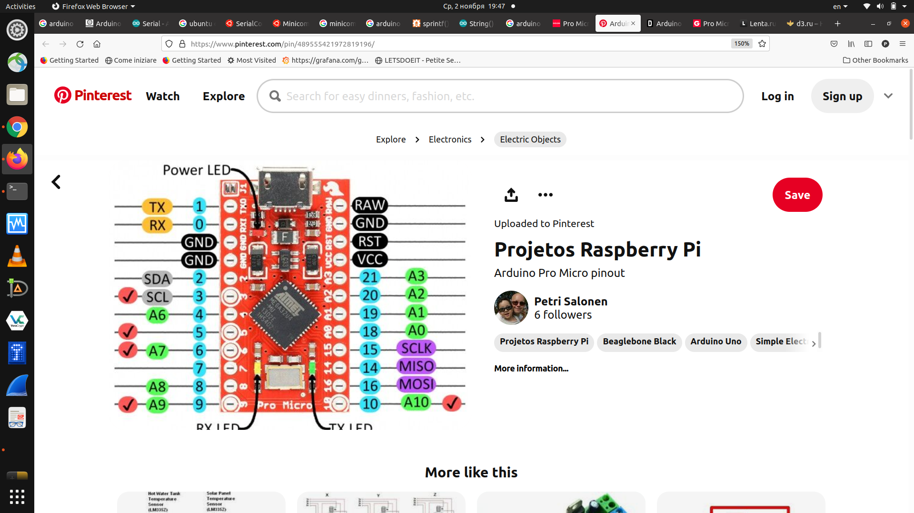
</div>

<div align="center">
    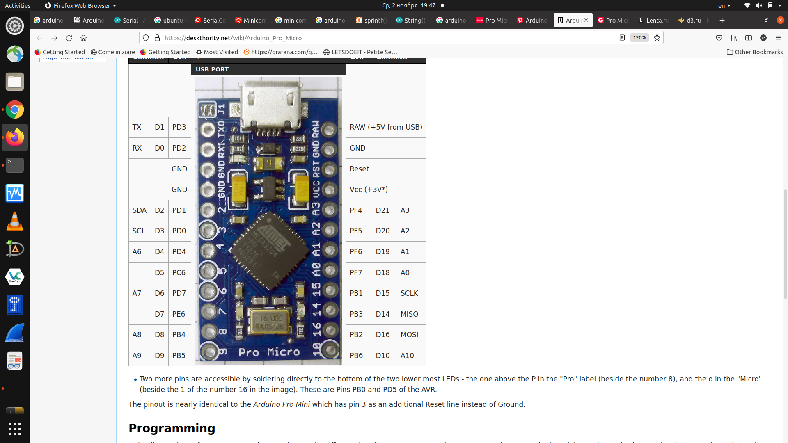
</div>


### [HEAD]MPU9250
* GY-9250/MPU-9250 (9-осевой датчик 3D положения, гироскоп, акселерометр, магнитометр)
* (10-ти осевой модуль датчика отслеживания CJMCU MPU9250 10DOF)[https://www.chipdip.ru/product0/8010864439]
  * https://compacttool.ru/10-ti-osevoj-modul-datchika-otslezhivaniya-cjmcu-mpu9250-10dof
* The MPU-9250 is comprised of the following key blocks and functions:
* Three-axis MEMS rate gyroscope sensor with 16-bit ADCs and signal conditioning
* Three-axis MEMS accelerometer sensor with 16-bit ADCs and signal conditioning
* Three-axis MEMS magnetometer sensor with 16-bit ADCs and signal conditioning
* Digital Motion Processor (DMP) engine
* Primary I 2 C and SPI serial communications interfaces
* Auxiliary I 2 C serial interface for 3 rd party sensors
* Clocking
* Sensor Data Registers
* FIFO: 512-byte FIFO register that is accessible via the Serial Interface.
* Interrupts
* Digital-Output Temperature Sensor: An on-chip temperature sensor and ADC are used to measure the MPU-9250 die temperature. The readings from the ADC can be read from the FIFO or the Sensor Data registers.
* Gyroscope, Accelerometer and Magnetometer Self-test: [r13, r16]
* Bias and LDO: The bias and LDO section generates the internal supply and the reference voltages and currents required by the MPU-9250.
* Charge Pump: An on-chip charge pump generates the high voltage required for the MEMS oscillators.


Here are some libs for this chip on github:
* [https://github.com/hideakitai/MPU9250.git](https://github.com/hideakitai/MPU9250)
* [https://github.com/kriswiner/MPU9250.git](https://github.com/kriswiner/MPU9250/)
* [Here is a dedicated library for MPU9250](https://www.arduino.cc/reference/en/libraries/mpu9250/)

<div align="center">
    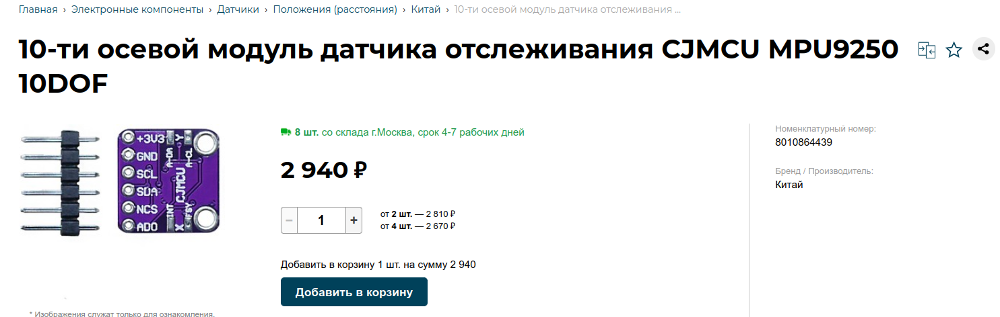
</div>

<div align="center">
    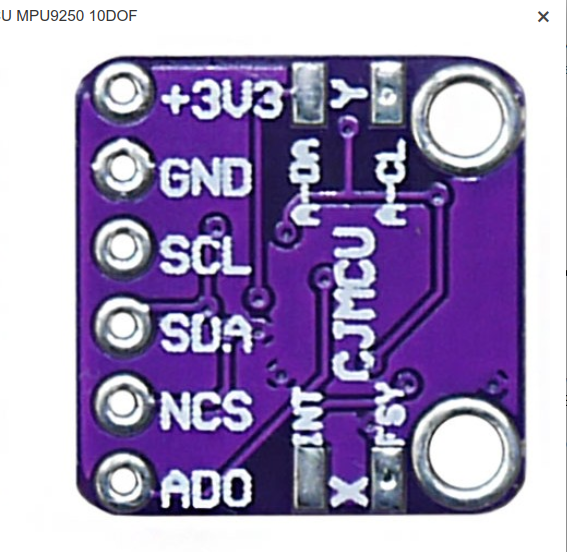
</div>


### [HEAD]Bluetooth module (HC-05 or HC-06)
* угловой разъем BLS-4 для подключения модуля Bluetooth
* Переходник USB-UART(TTL)


### [HEAD]Stuff
* Разъём PLS-4 (Папа)
* Разъём BLS-4 (Мама)
* Литиевая батарея 3,7V ёмкостью от 450mAh или больше, с внутренней платой защиты от переразряда.
* Выключатель с максимальным рабочим током 100mA или больше
* Трёхконтактный разъем "мама" BLS-3 с максимальным током 1A или больше, для подключения устройства заряда батареи.


# Assembling instructions


## CHARGER block
<div align="center">
    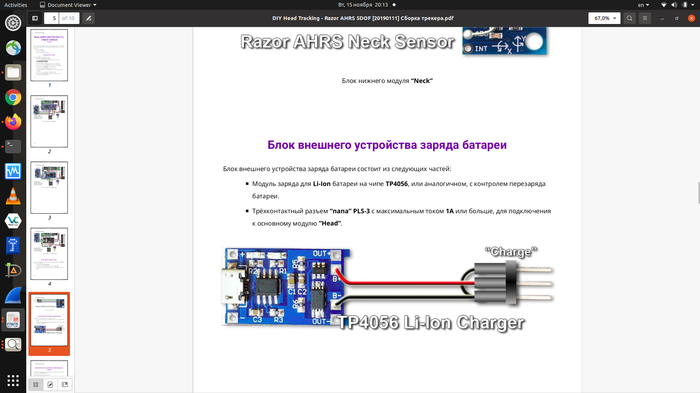
</div>


## NECK block
<div align="center">
    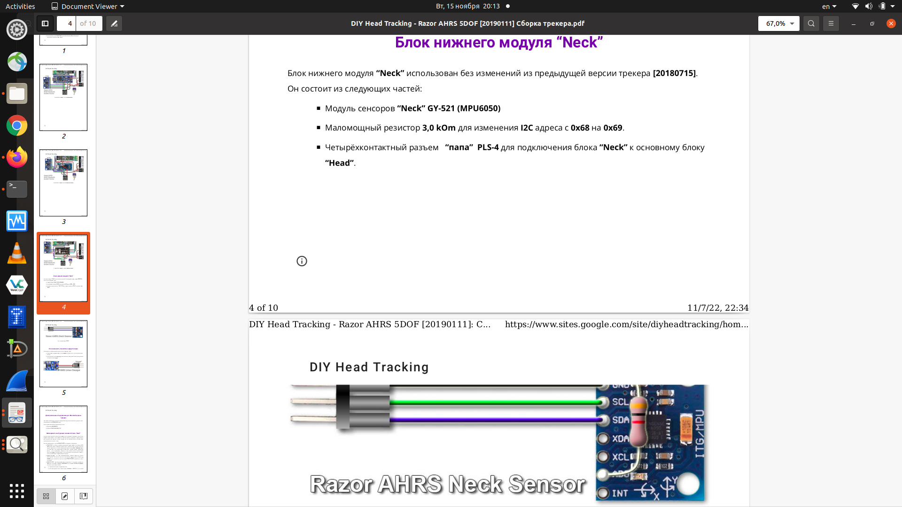
</div>


## HEAD block
<div align="center">
    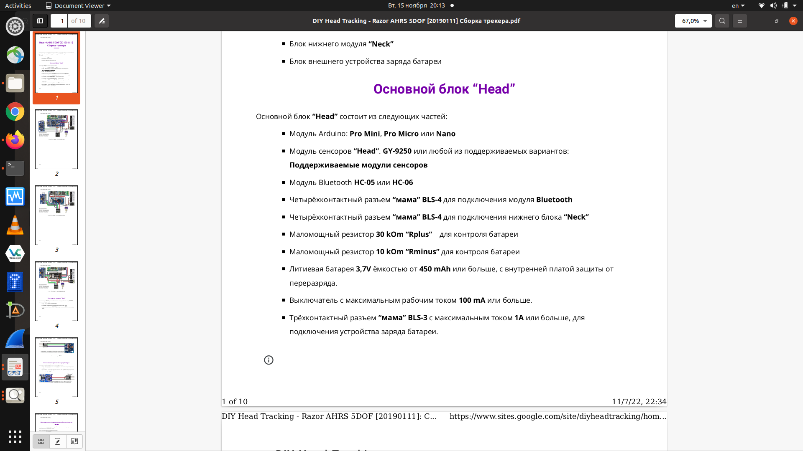
</div>

<div align="center">
    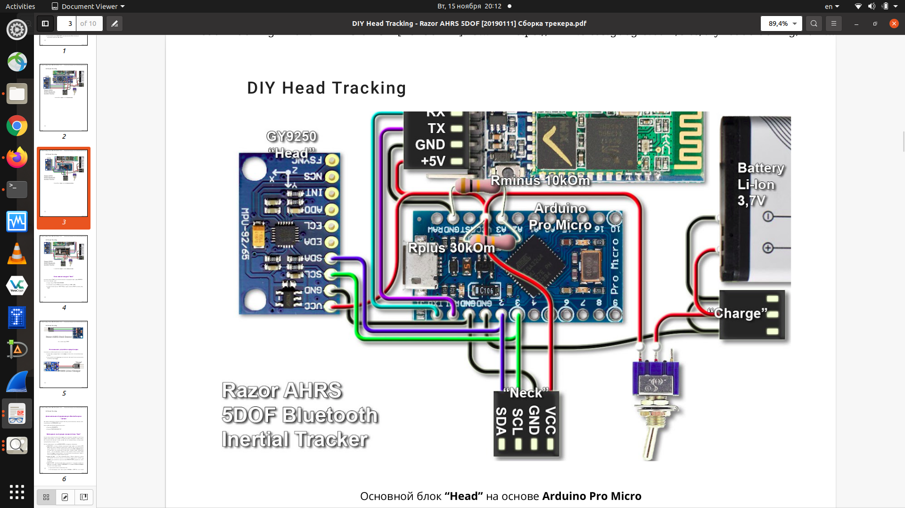
</div>


# Refefences
* https://amperka.ru/page/arduino-ide
* https://github.com/arduino/arduino-ide/releases/
* https://github.com/opentrack/opentrack/releases


# Examples


## ExampleA (razor-ahrs-5dof-20190111)

"""
Здорово Пилоты, в данном видео , я показываю как cделать  Инерционный трекер на базе платы Arduino NANO V 3.0 & датчика GY-85. Приятного просмотра. :)

Ссылка на сайт проекта: https://sites.google.com/site/diyhead...

Подписаться на канал - https://www.youtube.com/c/GTFanPlay
Дешёвые игры GT Fan Play покупает тут https://steambuy.com
Спасибо за лайк и за Вашу поддержку :)

Мой конфиг руля:
- Thrustmaster T300RS GT Edition - База и Руль
- Thrustmaster Rally Wheel Add-on Sparco R383 Mod - Руль
- Thrustmaster Ferrari F1 Wheel Add-On - Руль
- Thrustmaster TH8A Shifter - КПП

Мои Плейлисты
http://bit.ly/GT_Fan_Play_All_Playlists
"""


 - [Как сделать Инерционный трекер для Гонок и не только.......](https://www.youtube.com/watch?v=hKkj5Z_FWKo)\
 - [X-plane 11 | P3D | DCS world | WarThunder | 5ти осевой трекер за 1000 рублей | июнь 2020](https://www.youtube.com/watch?v=RhbhPYj6SKo)\
 - https://www.sites.google.com/site/diyheadtracking/home/5dof-tracker/razor-ahrs-5dof-20190111(https://www.sites.google.com/site/diyheadtracking/home/5dof-tracker)
 - https://github.com/arkhipenko/MPU9250


## ExampleB
- [Инерционный трекер на базе Arduino и GY-85 + Xbee pro S1](https://www.youtube.com/watch?v=HkD17MWOSjs)


## ExampleC (Подключение Акселерометра и Магнитометра (via I2C - SCL/SDA))
10-ти осевой модуль датчика отслеживания CJMCU MPU9250 10DOF\
[https://www.youtube.com/watch?v=gGNUtTtGCj0](Самодельный Head Tracker на STM32. Описание идеи устройства и начало разработки. Аксель LSM303DLHC)
last(1:47:??)


        time(1:41:??) - Connecting accelerometer
            His ACC setup:
                           200Hz
                           2G
                           16 bits
                           [-32768: +32767]
                           Reference data[144, 336, 16588]
                           My data[-26, 1774, 15936]
                           16013 - fits into 2G scale Z
        time(2:36:27) - Identifying axises for Accelerometer(Have to check with mines!)


        time(2:42:00) - Connecting magnetometer
            His MAG setup: 
                           Continious MODE!
                           220Hz
                           +/-1.3Gauss
                           12 bits
                           -[2048:2047]
                           Reference data[-126, -473, -627]
                           My data[23, 359, 205] (34.4860,  538.2808, 307.3748)
                           My data[-45, 59, -281] (-67.4725, 88.4640, -421.3285)

        time(3:01:45) - Charts\draw9ngs for A and M vectors


# Arduino joystick


## Видео как сделать что-бы ардуинка понималась виндой как джойстик
Там используется Gamepad из https://www.arduino.cc/reference/en/libraries/hid-project/\
https://www.youtube.com/watch?v=Wb2YhZVQl_4&t=1210s

https://github.com/NicoHood/HID

Supported HID devices:
* Keyboard with Leds out (8 modifiers + 6 keys pressed at the same time, + 1 limited linux consumer key)
* Teensy Keyboard with different keyboard layouts (german, french and many more) soon
* NKRO Keyboard with Leds out (press up to 113 keys at the same time)
* Mouse (5 buttons, move, wheel)
* BootKeyboard/BootMouse BIOS protocol support
* Absolute Mouse
* Consumer/Media Keys (4 keys for music player, web browser and more)
* System Key (for PC standby/shutdown)
* Gamepad (32 buttons, 4 16bit axis, 2 8bit axis, 2 D-Pads)
* RawHID
* SurfaceDial
* Each device is available as single or multi report device (except RawHID)

See the wiki for more information about features etc.


## Ещё одна либа которая так  и называется Joystick
https://github.com/MHeironimus/ArduinoJoystickLibrary/tree/version-2.0
The joystick or gamepad can have the following features:
* Buttons (default: 32)
* Up to 2 Hat Switches
* X, Y, and/or Z Axis (up to 16-bit precision)
* X, Y, and/or Z Axis Rotation (up to 16-bit precision)
* Rudder (up to 16-bit precision)
* Throttle (up to 16-bit precision)
* Accelerator (up to 16-bit precision)
* Brake (up to 16-bit precision)
* Steering (up to 16-bit precision)


## Тут чувак использует ту-же ArduinoJoystickLibrary для своего РУСа
https://www.youtube.com/watch?v=XcKmBWGFUn8


## Тут тоже пользуют ArduinoJoystickLibrary для своего РУСа
https://www.youtube.com/watch?v=wkY1NsbWj5I

